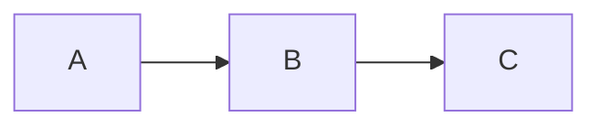

# Slidev FHSH AiSP 簡報模板

[](https://github.com/cxphoenix/slidev-repo-template/generate)
[](https://sli.dev)
[](https://vuejs.org)
[](http://creativecommons.org/licenses/by/4.0/)

> 專為開發者設計的現代化簡報模板，基於 Slidev 框架，使用 Markdown 語法快速建立專業簡報

## 📋 目錄

- [專案簡介](#專案簡介)
- [主要特色](#主要特色)
- [快速開始](#快速開始)
- [專案結構](#專案結構)
- [使用指南](#使用指南)
- [部署方式](#部署方式)
- [開發功能](#開發功能)
- [進階使用](#進階使用)
- [故障排除](#故障排除)
- [參考資源](#參考資源)

## 📖 專案簡介

這是一個基於 **Slidev** 的簡報模板專案，專為需要建立技術簡報的開發者設計。Slidev 是一個為開發者量身打造的簡報製作工具，使用 Markdown 語法撰寫內容，支援 Vue.js 元件、程式碼高亮、即時預覽等豐富功能。

### 什麼是 Slidev？

Slidev (slide + dev) 是一個基於 Web 的簡報製作與演示工具，具有以下核心優勢：

- **🎯 開發者友善**：使用 Markdown 語法，支援 Git 版本控制
- **⚡ 即時預覽**：基於 Vite 的快速熱重載功能
- **🎨 高度客製化**：支援自訂主題和 Vue.js 元件
- **📊 互動式內容**：內建程式碼編輯器、圖表、動畫效果
- **📤 多格式匯出**：支援 PDF、PPTX、PNG 及 SPA 格式
- **🎥 內建錄製**：支援畫面錄製與相機功能

## ✨ 主要特色

- **🚀 一鍵部署**：預設 Netlify 和 Vercel 部署設定
- **🎨 專業主題**：使用 `@cxphoenix/slidev-theme-fhsh-aisp` 主題
- **🧩 自訂元件**：包含目錄元件（CustomToc.vue）
- **📦 GitHub Template**：快速複製專案，立即開始使用
- **💡 程式碼範例**：內建 TypeScript 程式碼片段
- **📱 響應式設計**：適配各種裝置尺寸

## 🚀 快速開始

### 1. 使用 GitHub Template

點擊 [Use this template](https://github.com/cxphoenix/slidev-repo-template/generate) 按鈕，建立你的專案副本。

### 2. 複製到本地

```bash
git clone https://github.com/你的使用者名稱/你的專案名稱.git
cd 你的專案名稱
```

### 3. 安裝相依套件

```bash
# 推薦使用 pnpm
pnpm install

# 或使用 npm
npm install
```

### 4. 啟動開發伺服器

```bash
pnpm dev
# 或
npm run dev
```

開啟瀏覽器訪問 http://localhost:3030 即可預覽簡報。

## 📁 專案結構

```
├── slides.md              # 簡報內容主檔案
├── package.json           # 專案設定與相依性
├── components/            # 自訂 Vue 元件
│   └── CustomToc.vue     # 自訂目錄元件
├── snippets/             # 程式碼片段
│   └── external.ts       # TypeScript 範例程式碼
├── netlify.toml          # Netlify 部署設定
├── vercel.json           # Vercel 部署設定
└── public/               # 靜態資源目錄
```

### 核心檔案說明

- **`slides.md`**：簡報的主要內容檔案，使用 Markdown 語法撰寫
- **`package.json`**：定義專案相依性和執行腳本
- **`components/`**：存放自訂 Vue 元件，可在簡報中使用
- **`snippets/`**：程式碼片段，可在簡報中引用
- **部署設定檔**：預設的 Netlify 和 Vercel 部署配置

## 📝 使用指南

### 編輯簡報內容

簡報內容主要在 `slides.md` 檔案中編輯：

```markdown
---
theme: '@cxphoenix/slidev-theme-fhsh-aisp'
title: 你的簡報標題
drawings:
  persist: false
transition: slide-left
mdc: true
---

# 簡報標題

你的簡報內容...

---

## 第二頁

更多內容...
```

### 使用自訂元件

在簡報中使用自訂的 Vue 元件：

```markdown
# 目錄頁面

<CustomToc />
```

### 引用程式碼片段

```markdown
# 程式碼範例

<<< @/snippets/external.ts#snippet
```

### 基本語法

- **新增投影片**：使用 `---` 分隔每一頁
- **設定佈局**：在每頁開頭使用 `# layout: default`
- **新增動畫**：使用 `v-click` 指令
- **插入圖片**：``

## 🌐 部署方式

### GitHub Pages

1. 在 repository 的 Settings > Pages
2. 選擇 "GitHub Actions" 作為 source
3. 推送程式碼後自動部署到 `https://你的使用者名稱.github.io/專案名稱/`

### Netlify 部署

1. 連接你的 GitHub repository
2. 專案會自動讀取 `netlify.toml` 設定檔
3. 構建命令：`npm run build`
4. 發布目錄：`dist`

### Vercel 部署

1. 匯入 GitHub repository
2. 專案會自動讀取 `vercel.json` 設定檔
3. 一鍵部署，支援自動 CI/CD

### 手動構建

```bash
# 構建靜態檔案
pnpm build

# 構建後的檔案位於 dist/ 目錄
# 可部署到任何靜態檔案伺服器
```

## 🛠️ 開發功能

### 即時預覽

開發模式下支援即時預覽，修改 `slides.md` 後瀏覽器會自動重新載入。

```bash
pnpm dev --open  # 自動開啟瀏覽器
```

### 程式碼高亮

支援多種程式語言的語法高亮：

````markdown
```typescript
function hello(name: string): string {
  return `Hello, ${name}!`
}
```
````

### 數學公式

支援 LaTeX 數學公式：

```markdown
$$
\sum_{i=1}^{n} x_i = x_1 + x_2 + \cdots + x_n
$$
```

### 圖表支援

支援 Mermaid 圖表：

````markdown

````

## 📈 進階使用

### 自訂主題

修改 frontmatter 中的主題設定：

```markdown
---
theme: '@cxphoenix/slidev-theme-fhsh-aisp'
# 其他主題選項...
---
```

### 建立自訂元件

在 `components/` 目錄下建立新的 Vue 元件：

```vue
<!-- components/MyComponent.vue -->
<template>
  <div class="my-component">
    <h2>{{ title }}</h2>
  </div>
</template>

<script setup>
defineProps({
  title: String
})
</script>
```

### 匯出功能

```bash
# 匯出為 PDF
pnpm export

# 匯出為 PNG (每頁一張)
pnpm export --format png

# 匯出為 PPTX
pnpm export --format pptx
```

### 簡報者模式

在瀏覽器中按 `?` 鍵檢視所有快捷鍵，包括：

- `f`：全螢幕模式
- `o`：總覽模式
- `d`：暗黑模式切換
- `g`：跳轉到指定頁面

## 🔧 故障排除

### 常見問題

**Q: 安裝相依套件時出現錯誤**
```bash
# 清除 node_modules 並重新安裝
rm -rf node_modules package-lock.json
npm install
```

**Q: 開發伺服器無法啟動**
- 確保 Node.js 版本 ≥ 18.0
- 檢查 3030 port 是否被占用

**Q: 部署後樣式錯誤**
- 確認 base path 設定正確
- 檢查靜態資源路徑

### 系統需求

- **Node.js**: ≥ 18.0
- **套件管理器**: npm、pnpm、或 yarn
- **瀏覽器**: 支援現代 Web 標準的瀏覽器

### 除錯模式

```bash
# 以除錯模式啟動
DEBUG=slidev* pnpm dev
```

## 📚 參考資源

### 官方文件

- [Slidev 官方網站](https://sli.dev)
- [Slidev 文件](https://sli.dev/guide/)
- [主題畫廊](https://sli.dev/resources/theme-gallery)

### 相關套件

- [Vue.js](https://vuejs.org) - 前端框架
- [Vite](https://vitejs.dev) - 構建工具
- [UnoCSS](https://unocss.dev) - CSS 引擎
- [Shiki](https://shiki.style) - 程式碼高亮

### 學習資源

- [Markdown 語法指南](https://www.markdownguide.org)
- [Vue.js 官方教學](https://vuejs.org/tutorial/)
- [Slidev 範例集](https://github.com/slidevjs/slidev/tree/main/demo)

---

## 📄 授權條款

本專案採用 MIT 授權條款，詳見 [LICENSE](./LICENSE) 檔案。

## 🤝 貢獻

歡迎提交 Issue 和 Pull Request 來改善這個模板！

1. Fork 這個專案
2. 建立你的功能分支 (`git checkout -b feature/AmazingFeature`)
3. 提交你的修改 (`git commit -m 'Add some AmazingFeature'`)
4. 推送到分支 (`git push origin feature/AmazingFeature`)
5. 開啟一個 Pull Request

---

**🎯 讓我們一起用 Slidev 建立更棒的簡報！**